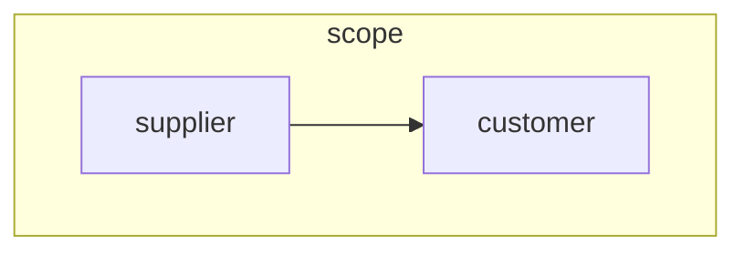

<!-- Don't edit. Generated by readme_test.dart -->
# Supply Chain - Data Flow & State Management

Supply Chain (SC) is a data flow and state management framework.

## Features

- ✅ Efficiently manage application state
- ✅ Visualize application data flow & dependencies
- ✅ Smoothly animate state transitions
- ✅ Efficient processing using caching and priorization
- ✅ Prevent unneccessary updates
- ✅ Query nodes and scopes
- ✅ Modify supply chains using plugins
- ✅ Create auto connecting smart nodes

## Concept

A customer `nodes` receive components from one or more supplier nodes. Each node
creates a `product`, that is delivered to customer nodes. The application state
is modelled as an supply chain. Nodes again are put into nested `scopes`. A
`supply chain manager` (SCM) coordinates the process.



## Getting started

The following test demonstrates important supply chain features.

```dart
// @license
// Copyright (c) ggsuite
//
// Use of this source code is governed by terms that can be
// found in the LICENSE file in the root of this package.

import 'package:gg_golden/gg_golden.dart';
import 'package:supply_chain/supply_chain.dart';
import 'package:test/test.dart';

void main() {
  test('Basic Tutorial', () async {
    // .............................
    // Create a supply chain manager
    // Setting isTest to true will apply all changes
    // once flush is called
    final scm = Scm(isTest: true);

    // ...................
    // Create a root scope
    final rootScope = Scope.root(key: 'root', scm: scm);

    // Create a main scope
    const scopeBp = ScopeBluePrint(key: 'scope');
    final scope = scopeBp.instantiate(scope: rootScope);

    // ......................
    // Create a supplier node

    // First create a blue print
    const supplierBp = NodeBluePrint<int>(initialProduct: 1, key: 'supplier');

    // Instantiate the blue print
    final supplier = supplierBp.instantiate(scope: scope);

    // ......................
    // Create a customer node
    // doubling the product of the supplier
    final customerBp = NodeBluePrint<int>(
      key: 'customer',
      initialProduct: 1,
      suppliers: ['supplier'],
      produce: (components, previousProduct, node) {
        final supplier = components[0] as int;
        return supplier * 2;
      },
    );

    final customer = customerBp.instantiate(scope: scope);

    // .................
    // Apply all changes
    scm.flush();

    // ......................
    // The customer has doubled the product of the supplier
    expect(supplier.product, 1);
    expect(customer.product, 1 * 2);

    // ........................
    // Change and apply changes

    // Change the supplier value
    supplier.product = 5;

    // Apply the changes
    scm.flush();

    // The customer value is also changed
    expect(supplier.product, 5);
    expect(customer.product, 5 * 2);

    // .............
    // Search a node just using the key. The first found scope is returned.
    final foundCustomer = rootScope.findNode<int>('customer');
    expect(foundCustomer, customer);

    // Add more context to be more precise
    final foundCustomer1 = rootScope.findNode<int>('scope/customer');
    expect(foundCustomer1, customer);

    // Use the complete path to find a very special node
    final foundCustomer2 = rootScope.findNode<int>('root/scope/customer');
    expect(foundCustomer2, customer);

    // If a node cannot be found, findNode returns null
    final foundCustomer3 = rootScope.findNode<int>('xyz');
    expect(foundCustomer3, isNull);

    // In the same way scopes can be searched
    final foundScope = customer.scope.findScope('scope');
    expect(foundScope, scope);

    // ..........................
    // Print node and scope graph
    final graph = scope.mermaid();
    await writeGolden(fileName: 'basic_01.mmd', data: graph);

    // ...............................
    // Show all node pathes of a scope
    final allNodePathes = rootScope.ls();
    await writeGolden(fileName: 'all_node_pathes.json', data: allNodePathes);
    expect(allNodePathes, [
      'scope',
      'scope/supplier (5)',
      'scope/customer (10)',
    ]);
  });
}

```

## Features and bugs

Please file feature requests and bugs at [GitHub](https://github.com/ggsuite/supply_chain).
