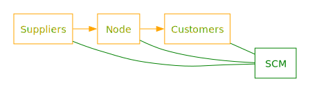

# Supply Chain - Data Flow & State Management

Supply Chain (SC) is a data flow and state management architecture.

## Table of Content <!-- omit in toc -->

- [Idea](#idea)
- [Goals](#goals)
- [Getting Started](#getting-started)
- [Features](#features)
  - [Effective Asynchronous Workflow](#effective-asynchronous-workflow)
  - [Priorization](#priorization)
  - [Animations](#animations)
  - [No Unneccessary Updates](#no-unneccessary-updates)
  - [Build-In Test Methods](#build-in-test-methods)
  - [Timeout Protection](#timeout-protection)
  - [Visualize the Node Graph](#visualize-the-node-graph)
- [Features and bugs](#features-and-bugs)

## Idea

- A `node` receives components from one or more `suppliers`.
- It produces a `product` and delivers it to `customers`.
- Doing so complex data flow graphs can be created.
- A supply chain manager `SCM` coordinates the process.

## Goals

- ✅ Efficiently manage application state
- ✅ Visualize application data flow & dependencies
- ✅ Smoothly animate state transitions
- ✅ Data caching
- ✅ Prioritze updates

## Getting Started

- Checkout the example
- Checkout `node_test.dart`
- Checkout `scm_test.dart`

## Features

### Effective Asynchronous Workflow

- Our workflow consists of three stages: `Nomination`, `Preparation` and `Production`.
- In the first stage `nodes` are `nominated` for production
- The SCM collects nominated nodes for a short time, e.g. a frame or a event loop cycle.
- In the second stage, the SCM `prepares` a dependency graph. Nodes are `staged` for production.
- In the final step nodes are instructed to `produce` depending on dependencies and priorities.

### Priorization

- Node can have a `priority`.
- Nodes with higher priorities are processed first.
- If a node has a high priority, its suppliers will a high priority too.
- Currently a `realtime` and a `frame` priority is offered.
- Nodes with `realtime` priority will produce in the same run loop cycle.
- Nodes with `frame` priority will produce at the next frame / tick.

### Animations

- Scm offers a `tick()` method.
- Tick will `nominate` all nodes with `frame` priority
- These node are instructed to provide a new product on every frame

### No Unneccessary Updates

- All products produced by suppliers have a hash
- SCM uses suppliers to estimate if a node needs to produce or not
- No hash changes, no production.
- Additionally SCM builds a dependency graph

### Build-In Test Methods

- We break the paradigm not to mix production and test code
- Scm can be set to test mode using the `isTest` constructor param
- Use methods like `testRunNormalTasks`, `testRunFastTasks` etc. to control the test flow

### Timeout Protection

- I a node does not produce in a given time window, it will be skipped
- Thus nodes cannot block the production process

### Visualize the Node Graph

- Use `Scm.graph` to get a `Graphviz` graph that can be turned into an svg file

## Features and bugs

Please file feature requests and bugs at [GitHub](https://github.com/inlavigo/gg_supply_chain).
