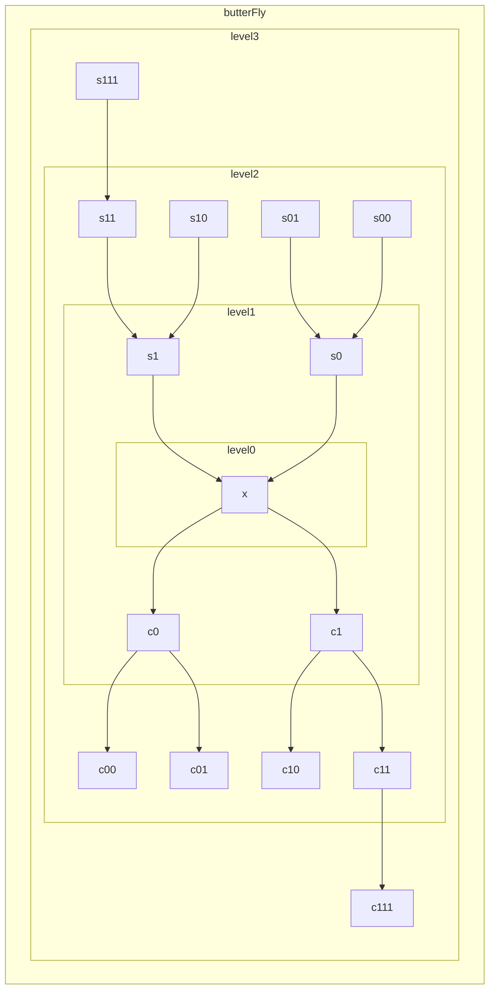

<!--
@license
Copyright (c) 2019 - 2024 Dr. Gabriel Gatzsche. All Rights Reserved.

Use of this source code is governed by terms that can be
found in the LICENSE file in the root of this package.
-->

## A Mermaid Sample Diagram

