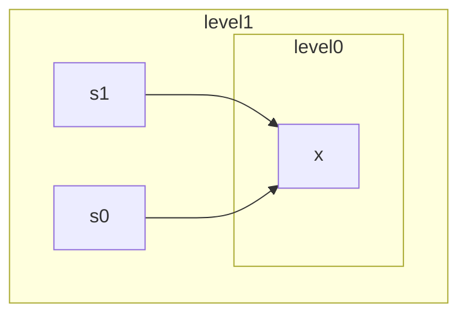

```mermaid
flowchart TD
  subgraph level1_118["level1"]
    s1_113["s1"]
    s0_114["s0"]
    subgraph level0_120["level0"]
      x_115["x"]
    end
  end

  s1_113 --> x_115;
  s0_114 --> x_115;

  classDef highlight fill:#FFFFAA,stroke:#333;
```