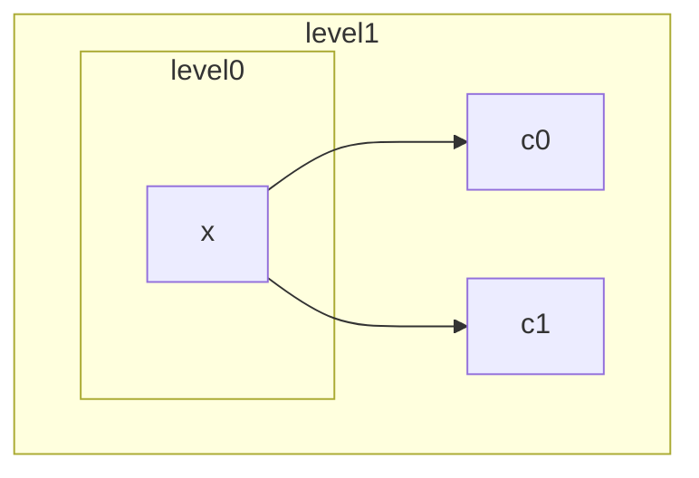

```mermaid
flowchart TD
  subgraph level1_132["level1"]
    c0_131["c0"]
    c1_132["c1"]
    subgraph level0_134["level0"]
      x_130["x"]
    end
  end

  x_130 --> c0_131;
  x_130 --> c1_132;

  classDef highlight fill:#FFFFAA,stroke:#333;
```