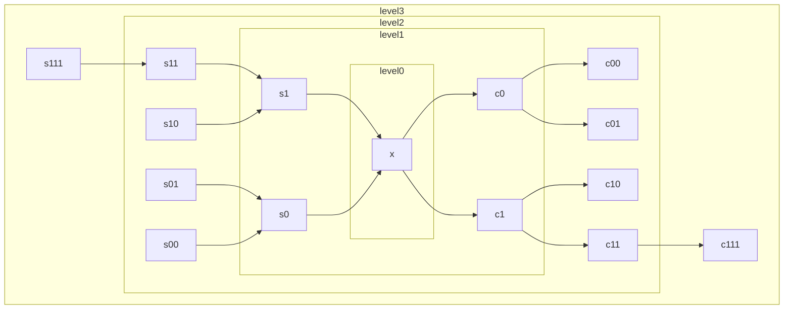

```mermaid
flowchart TD
  subgraph level3_156["level3"]
    s111_153["s111"]
    c111_167["c111"]
    subgraph level2_158["level2"]
      s11_154["s11"]
      s10_155["s10"]
      s01_156["s01"]
      s00_157["s00"]
      c00_163["c00"]
      c01_164["c01"]
      c10_165["c10"]
      c11_166["c11"]
      subgraph level1_160["level1"]
        s1_158["s1"]
        s0_159["s0"]
        c0_161["c0"]
        c1_162["c1"]
        subgraph level0_162["level0"]
          x_160["x"]
        end
      end
    end
  end

  s111_153 --> s11_154;
  s11_154 --> s1_158;
  s10_155 --> s1_158;
  s01_156 --> s0_159;
  s00_157 --> s0_159;
  c11_166 --> c111_167;
  s1_158 --> x_160;
  s0_159 --> x_160;
  c0_161 --> c00_163;
  c0_161 --> c01_164;
  c1_162 --> c10_165;
  c1_162 --> c11_166;
  x_160 --> c0_161;
  x_160 --> c1_162;

  classDef highlight fill:#FFFFAA,stroke:#333;
```