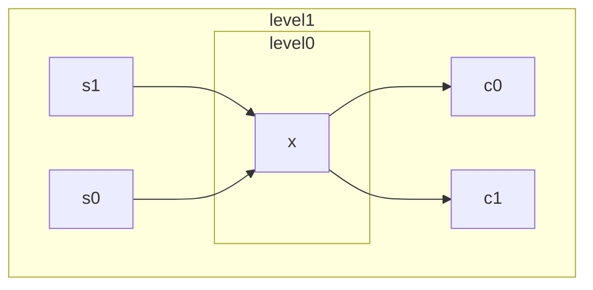

```mermaid
flowchart TD
  subgraph level1_146["level1"]
    s1_143["s1"]
    s0_144["s0"]
    c0_146["c0"]
    c1_147["c1"]
    subgraph level0_148["level0"]
      x_145["x"]
    end
  end

  s1_143 --> x_145;
  s0_144 --> x_145;
  x_145 --> c0_146;
  x_145 --> c1_147;

  classDef highlight fill:#FFFFAA,stroke:#333;
```