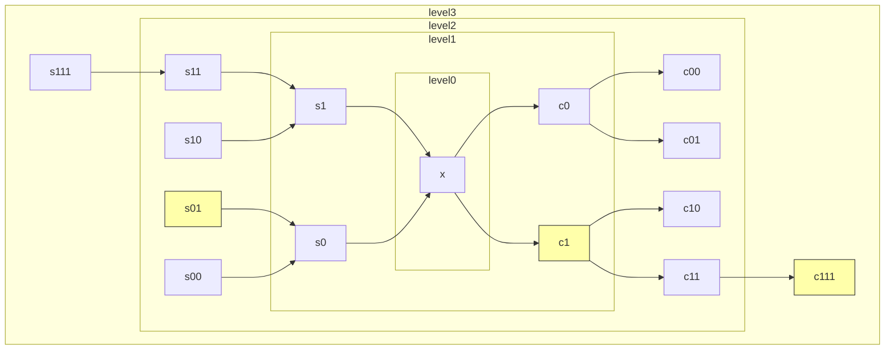

```mermaid
flowchart TD
  subgraph level3_170["level3"]
    s111_168["s111"]
    c111_182["c111"]:::highlight
    subgraph level2_172["level2"]
      s11_169["s11"]
      s10_170["s10"]
      s01_171["s01"]:::highlight
      s00_172["s00"]
      c00_178["c00"]
      c01_179["c01"]
      c10_180["c10"]
      c11_181["c11"]
      subgraph level1_174["level1"]
        s1_173["s1"]
        s0_174["s0"]
        c0_176["c0"]
        c1_177["c1"]:::highlight
        subgraph level0_176["level0"]
          x_175["x"]
        end
      end
    end
  end

  s111_168 --> s11_169;
  s11_169 --> s1_173;
  s10_170 --> s1_173;
  s01_171 --> s0_174;
  s00_172 --> s0_174;
  c11_181 --> c111_182;
  s1_173 --> x_175;
  s0_174 --> x_175;
  c0_176 --> c00_178;
  c0_176 --> c01_179;
  c1_177 --> c10_180;
  c1_177 --> c11_181;
  x_175 --> c0_176;
  x_175 --> c1_177;

  classDef highlight fill:#FFFFAA,stroke:#333;
```