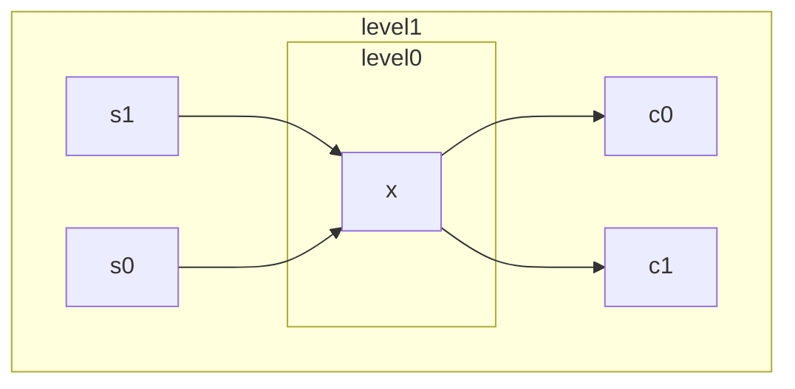

```mermaid
flowchart TD
  subgraph level1_216["level1"]
    s1_218["s1"]
    s0_219["s0"]
    c0_221["c0"]
    c1_222["c1"]
    subgraph level0_218["level0"]
      x_220["x"]
    end
  end

  s1_218 --> x_220;
  s0_219 --> x_220;
  x_220 --> c0_221;
  x_220 --> c1_222;

  classDef highlight fill:#FFFFAA,stroke:#333;
```