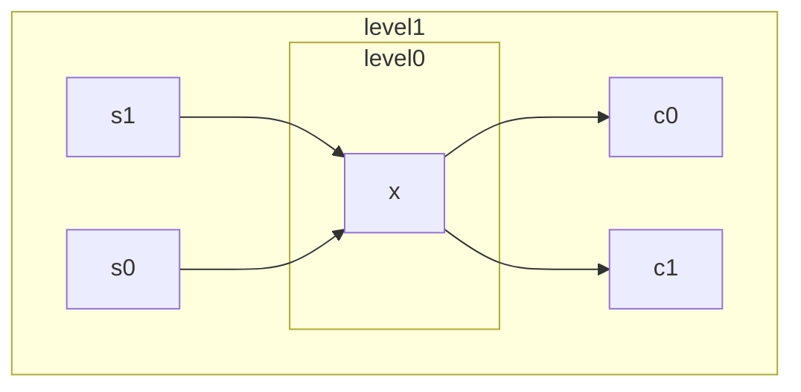

```mermaid
flowchart TD
  subgraph level1_230["level1"]
    s1_233["s1"]
    s0_234["s0"]
    c0_236["c0"]
    c1_237["c1"]
    subgraph level0_232["level0"]
      x_235["x"]
    end
  end

  s1_233 --> x_235;
  s0_234 --> x_235;
  x_235 --> c0_236;
  x_235 --> c1_237;

  classDef highlight fill:#FFFFAA,stroke:#333;
```