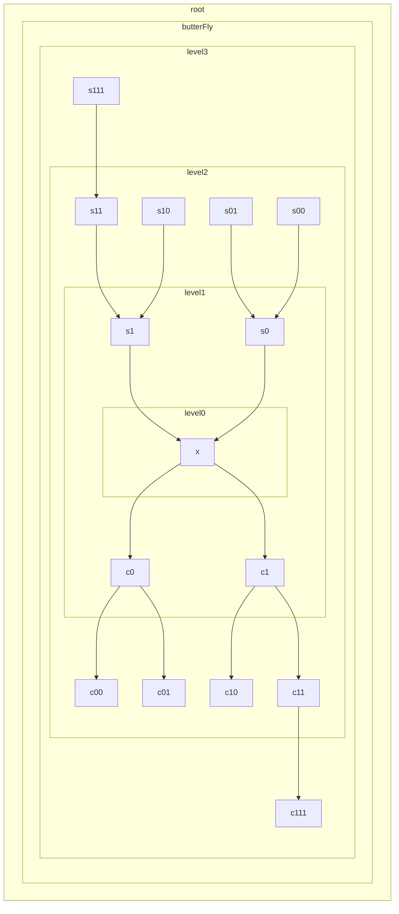

```mermaid
flowchart TD
  subgraph root_236["root"]
    subgraph butterFly_238["butterFly"]
      subgraph level3_240["level3"]
        s111_243["s111"]
        c111_257["c111"]
        subgraph level2_242["level2"]
          s11_244["s11"]
          s10_245["s10"]
          s01_246["s01"]
          s00_247["s00"]
          c00_253["c00"]
          c01_254["c01"]
          c10_255["c10"]
          c11_256["c11"]
          subgraph level1_244["level1"]
            s1_248["s1"]
            s0_249["s0"]
            c0_251["c0"]
            c1_252["c1"]
            subgraph level0_246["level0"]
              x_250["x"]
            end
          end
        end
      end
    end
  end

  s111_243 --> s11_244;
  s11_244 --> s1_248;
  s10_245 --> s1_248;
  s01_246 --> s0_249;
  s00_247 --> s0_249;
  c11_256 --> c111_257;
  s1_248 --> x_250;
  s0_249 --> x_250;
  c0_251 --> c00_253;
  c0_251 --> c01_254;
  c1_252 --> c10_255;
  c1_252 --> c11_256;
  x_250 --> c0_251;
  x_250 --> c1_252;

  classDef highlight fill:#FFFFAA,stroke:#333;
```