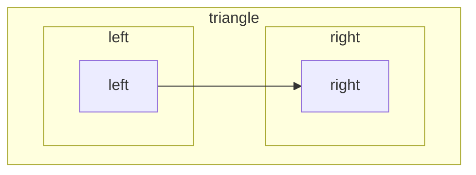

```mermaid
flowchart TD
  subgraph triangle_2["triangle"]
    subgraph left_3["left"]
      left_1["left"]
    end
    subgraph right_4["right"]
      right_2["right"]
    end
  end

  left_1 --> right_2;

  classDef highlight fill:#FFFFAA,stroke:#333;
```