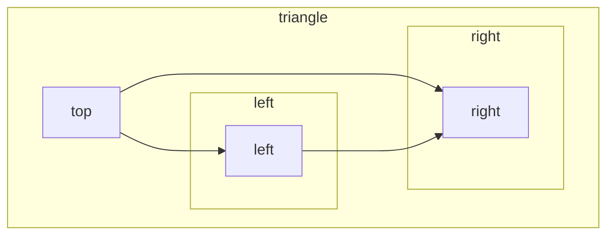

```mermaid
flowchart TD
  subgraph triangle_4["triangle"]
    top_0["top"]
    subgraph left_6["left"]
      left_1["left"]
    end
    subgraph right_8["right"]
      right_2["right"]
    end
  end

  top_0 --> left_1;
  top_0 --> right_2;
  left_1 --> right_2;

  classDef highlight fill:#FFFFAA,stroke:#333;
```