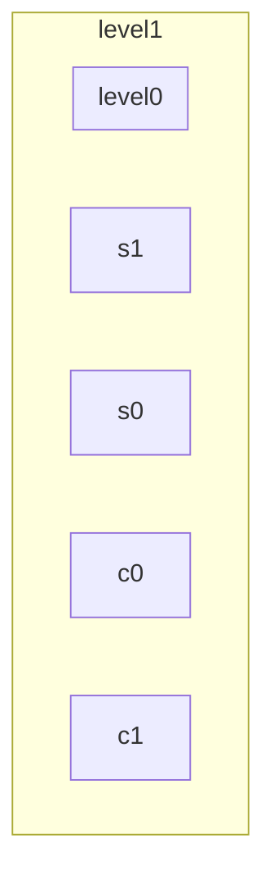

```mermaid
flowchart TD
  subgraph level1_272["level1"]
    s1_278["s1"]
    s0_279["s0"]
    c0_281["c0"]
    c1_282["c1"]
    subgraph level0_274["level0"]
    end
  end


  classDef highlight fill:#FFFFAA,stroke:#333;
```