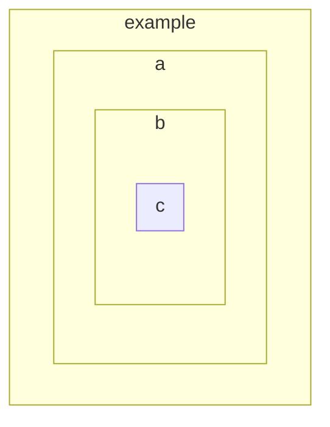

```mermaid
flowchart TD
  subgraph example_294["example"]
    subgraph a_296["a"]
      subgraph b_298["b"]
        subgraph c_300["c"]
        end
      end
    end
  end


  classDef highlight fill:#FFFFAA,stroke:#333;
```